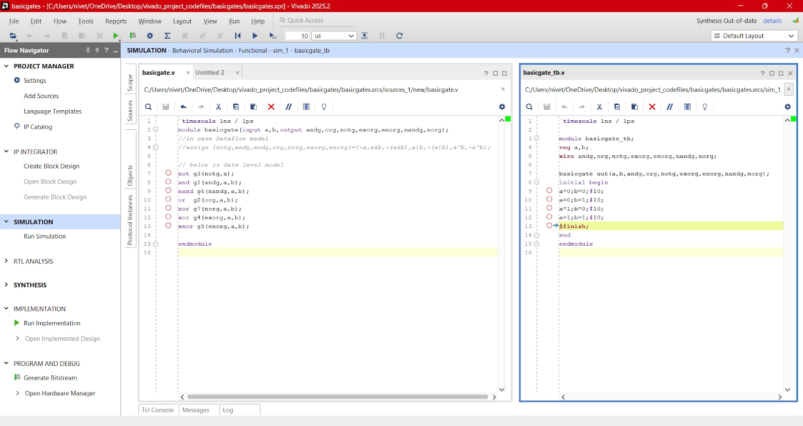
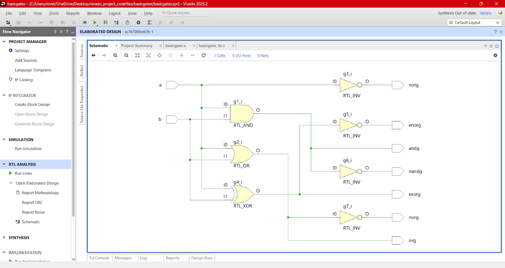
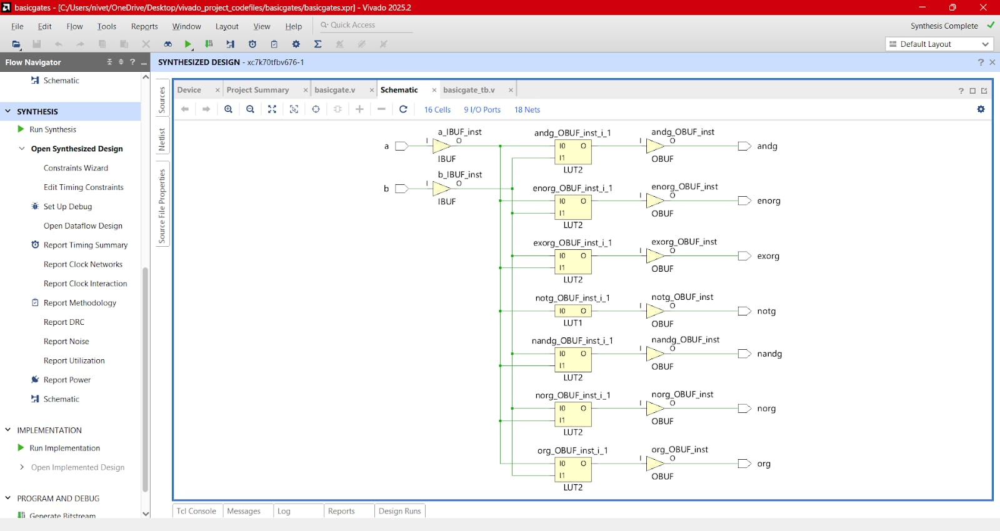
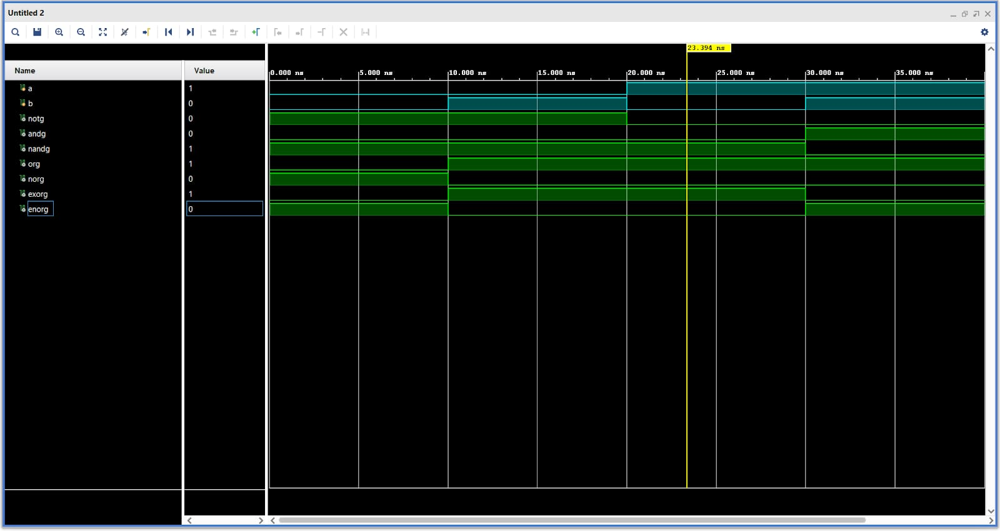

# Design:Basic Logic Gates 
## Why I started with Basic Gates
I chose to begin my portfolio with basic logic gates because they are the "atoms" of digital design. Even the most complex processors are just millions of these gates working together.    

---

## Overview of Verilog Modeling Abstractions

<b>Touch here to see more</b>

  
In digital design, hardware description levels define the granularity at which a system is modeled. These levels represent a trade-off between design complexity and synthesis efficiency.
### 1. Switch-Level Modeling
  - Switch-level modeling is the lowest level of abstraction in Verilog. It represents hardware as a network of transistors and interconnecting wires, focusing on the physical switching behavior of MOS devices.
  -  **Core Primitives:** Utilizes nmos, pmos, and cmos switches.
- **Design Application:** Primarily used for transistor-level simulation and the development of standard cell libraries.
### 2. Gate-Level Modeling
- Gate-level modeling describes a circuit in terms of its logical primitives. It provides an explicit representation of the logical micro-architecture before it is mapped to a specific technology.
- **Core Primitives:** Utilizes built-in logic gates such as and, or,nand, xor, and not.
- **Design Application:** Used for small-scale logic blocks or when manual control over the gate-level structure is required for timing or area optimization.
### 3. Dataflow Modeling
- Dataflow modeling specifies the design by describing the flow of data through Boolean equations. This abstraction level is highly efficient for combinational logic design.
- **Core Constructs:** Uses the assign keyword and bit-wise operators such as &, |, and ^.
- **Design Application:** Preferred for combinational circuits as it is highly readable and allows synthesis tools to optimize the logic mapping to FPGA resources.
### 4. Behavioral Modeling
- Behavioral modeling represents the design at the highest level of abstraction, focusing on the algorithm or the functional behavior of the circuit rather than its physical implementation.
- **Core Constructs:** Uses procedural blocks like always and initial alongside conditional statements like if-else and case.
- **Design Application:** The industry standard for modeling complex logic, synchronous sequential circuits, and Finite State Machines (FSMs).
### 5. Structural Modeling
- Structural modeling represents the hierarchical organization of a system. It describes the interconnections between pre-defined modules to form a larger, complex architecture.
- **Core Constructs:** Based on module instantiation and explicit port mapping.
- **Design Application:** Essential for top-level system integration, facilitating modular design, scalability, and project management.
  
  

  
  ---

  ### Design Resources
  
 *  **Verilog Design Source file**(.v) — [Click here](./src/basicgate.v)to view the synthesizable RTL code
 *  **Functional Testbench(.v)** — [Click here](./tb/basicgate_tb.v)  to view the verification environment and test vectors.
 
## Hardware Analysis & Verification

### 1. Design Implementation (RTL Source)
. 
- Here basichgate module ,I used Gate level of modelling and also mentioned the dataflow modelling of this module in the same verilog code as a comment lines.

### 2. Verification Environment (Testbench)

### 3.Truth Table

| **Inputs** | | **Outputs** | | | | | | |
| :---: | :---: | :---: | :---: | :---: | :---: | :---: | :---: | :---: |
| **A** | **B** | **NOT (A)** | **AND** | **NAND** | **OR** | **NOR** | **XOR** | **XNOR** |
| 0 | 0 | 1 | 0 | 1 | 0 | 1 | 0 | 1 |
| 0 | 1 | 1 | 0 | 1 | 1 | 0 | 1 | 0 |
| 1 | 0 | 0 | 0 | 1 | 1 | 0 | 1 | 0 |
| 1 | 1 | 0 | 1 | 0 | 1 | 0 | 0 | 1 |

### 4. Elaborated Design (RTL Schematic)

### 5. Synthesized Design (Technology Map)

### 6. Functional Simulation (XSim Waveforms)

- From waveform,I also get expected output for all input combination.
 - **Note:**
      - Inputs waveform in blue 🔵 Colour, Outputs are in 🟢 colour.
  
   ---
   
   ---

## **Next Steps**

➡️ **[Navigate to Day 02](../Day02/)**

