# Design:Half_Adder,Full_adder,Ripple_Carry_Adder
   - Addition is one of the most basic operations performed by different electronic devices like computers, calculators,even nowadays AI calculation etc. The electronic circuit that performs the addition of two or more numbers, more specifically binary numbers, is called as adder.
## Half_Adder:

<b>Touch here to see more</b>

   
  - Half Adder is a basic combinational design that can add two single bits and results to a sum and carry bit as output.
  - The carry obtained in one addition will not be forwarded in the next addition because of this it is known as half adder whereas in Full adder we can forward the carry to other adder.
    - **Inputs**: 1bit **A**,**B**.
    - **Outputs**: 1bit **Sum**,**Carry**.
 ### Block Diagram
    

 
 ### Equation
   - **Sum** = A ^ B      ----> A exor B
   - **Carry** = A & B   ----> A and B
### Half_Adder(Verilog Codes)
-  Design module [half_adder.v](./src/half_adder.v) 
- Testbench [tb_half_adder.v](./tb/tb_half_adder.v) 
### Output Screenshots
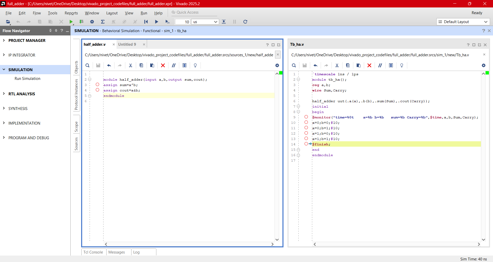
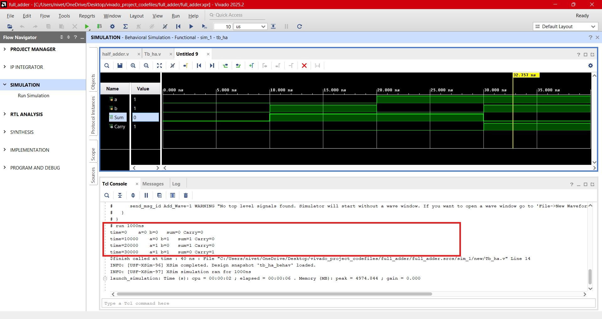
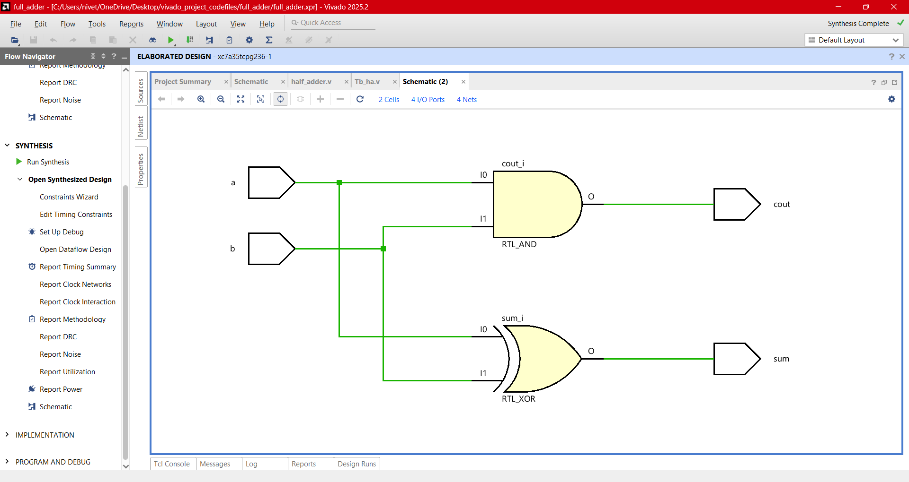
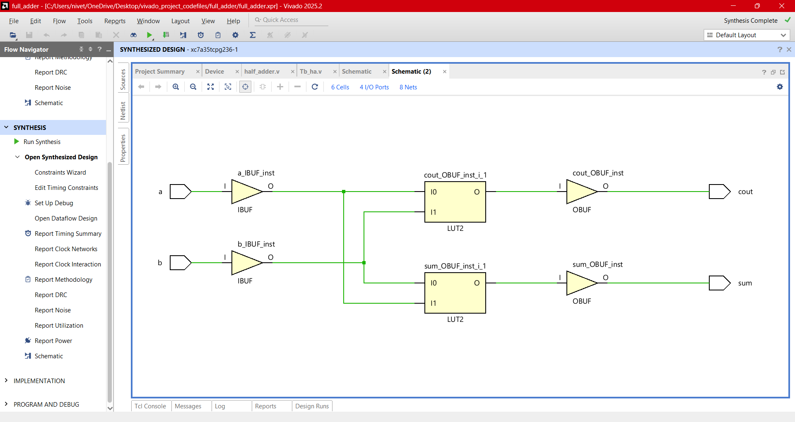

---

## Full_Adder using Half Adder:

<b>Touch here to see more</b>

   
  - A combinational logic circuit that can add two binary digits (bits) and a carry bit, and produces a sum bit and a carry bit as output is known as a full-adder.
  - A full adder circuit adds three binary digits, where two are the inputs and one is the carry forwarded from the previous addition.
    - **Inputs**: 1bit **A**,**B**,**Cin**.
    - **Outputs**: 1bit **Sum**,**Carry**.
 ### Block Diagram

### Equation
   - **Sum** = A ^ B ^ Cin     ----> A exor B exor Cin
   - **Carry** = (A & B)|(Cin &(A^B)) (or)   AB+BC+AC
### Full_Adder(Verilog Codes)
-  Design module [full_adder.v](./src/full_adder.v) 
- Testbench [tb_full_adder.v](./tb/tb_full_adder.v) 
### Output Screenshots
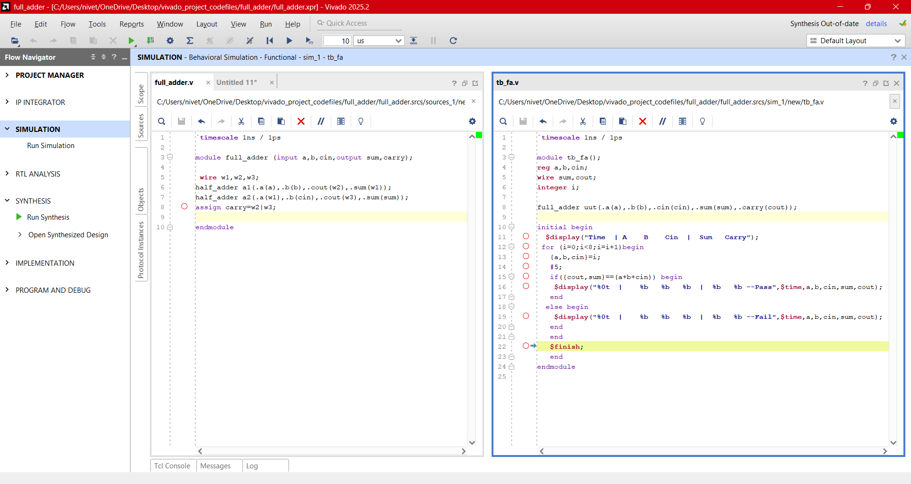
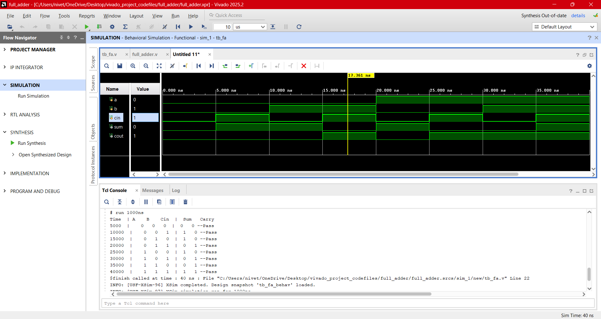
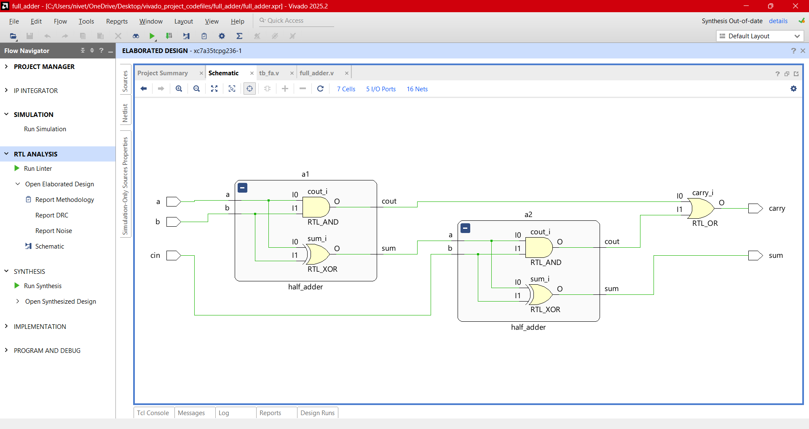
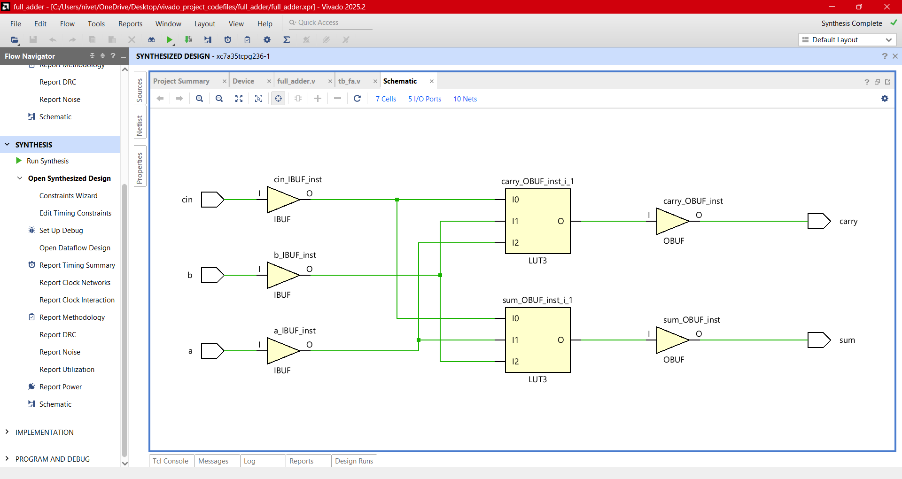

---
## Ripple_Carry_Adder or Parallel Adder:

<b>Touch here to see more</b>

   
  - Full adder can add single bit two inputs and extra carry bit generated from its previous stage. To add multiple 'n' bits binary sequence, multiples cascaded full adders can be used which can generate a carry bit and be applied to the next stage full adder as an input till the last stage of full adder. This appears as carry-bit ripples to the next stage, hence it is known as "Ripple carry adder".
    - **Inputs**: n-bit **A**,**B**,1-bit **Cin**.
    - **Outputs**: n-bit **Sum**,1-bit **Carry_out**.

### Ripple carry adder delay computation 
- Worst case delay = ((n-1) full adder * carry propagation delay of each adder)+ sum propagation delay of each full adder
 ### Block Diagram
 

### Ripple_Carry_Adder(Verilog Codes)
-  Design module [rca_adder.v](./src/rca.v) 
- Testbench [tb_rca_adder.v](./tb/tb_rca.v) 
### Output Screenshots
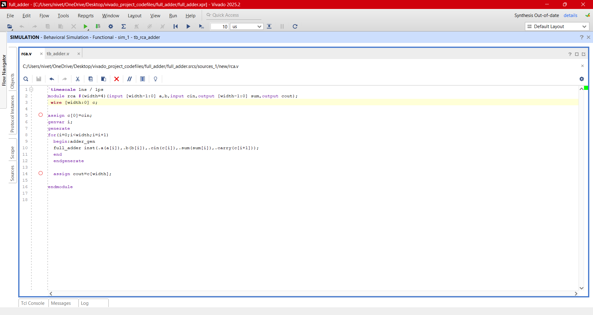
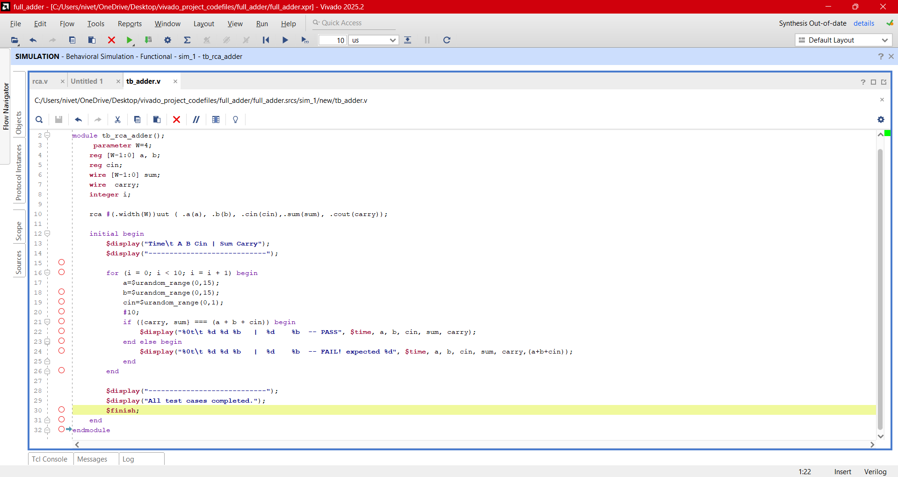
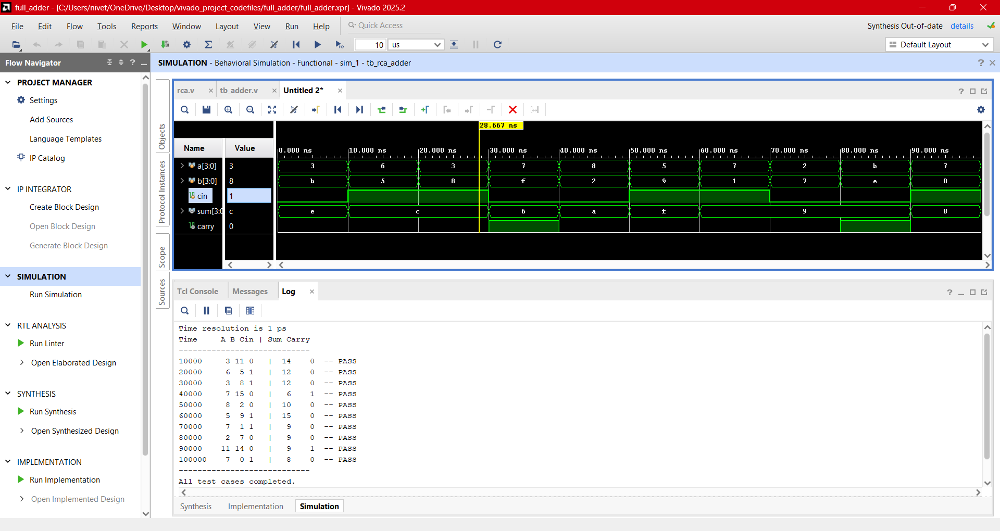
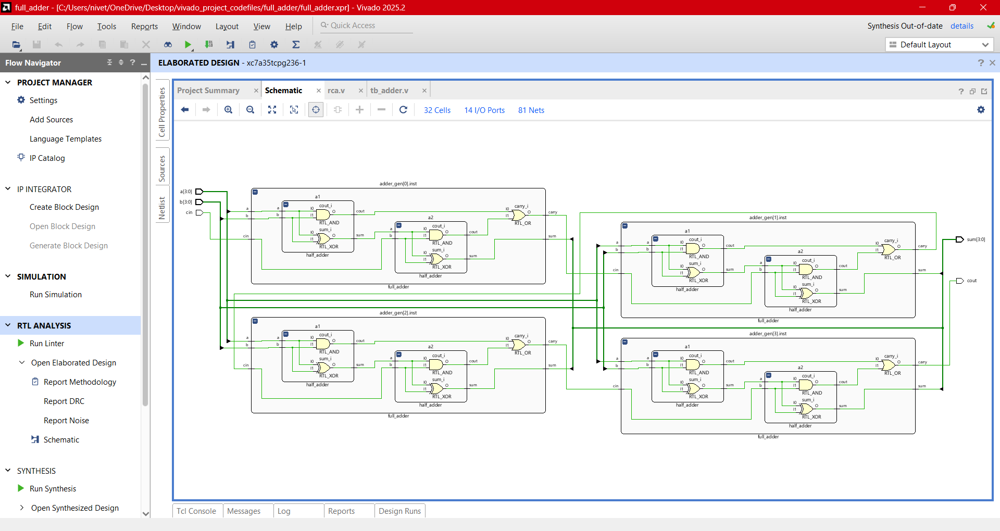
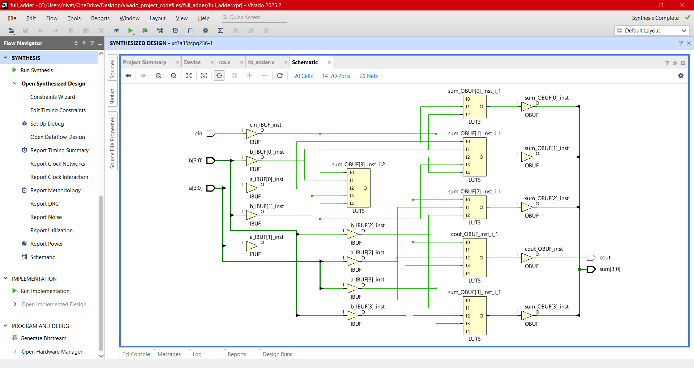

---
## Design Hierarchy
- Design Hierarchy is a "bottom-up" structure where simple modules (Half Adders) are nested inside larger modules (Full Adders) to build a complex system (Ripple Carry Adder).
  
## **Next Steps**

➡️ **[Navigate to Day 03](../day_03/)**
