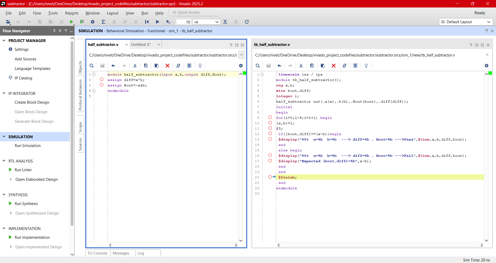
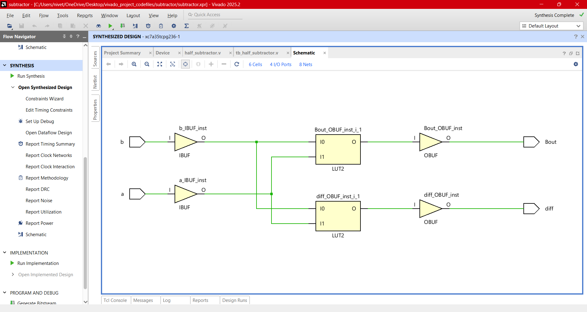
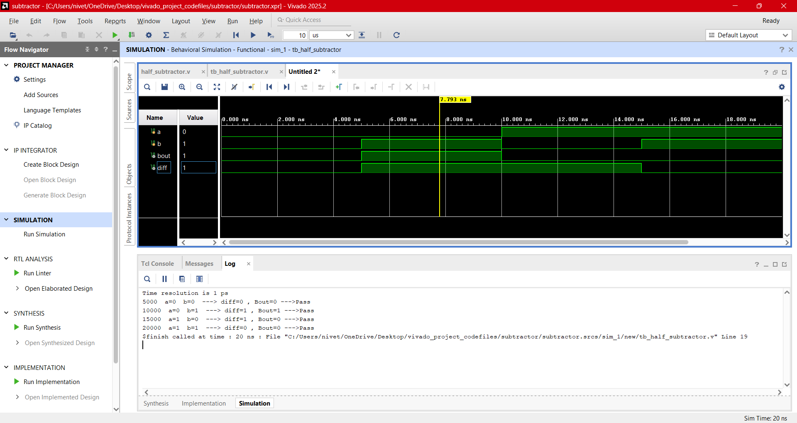
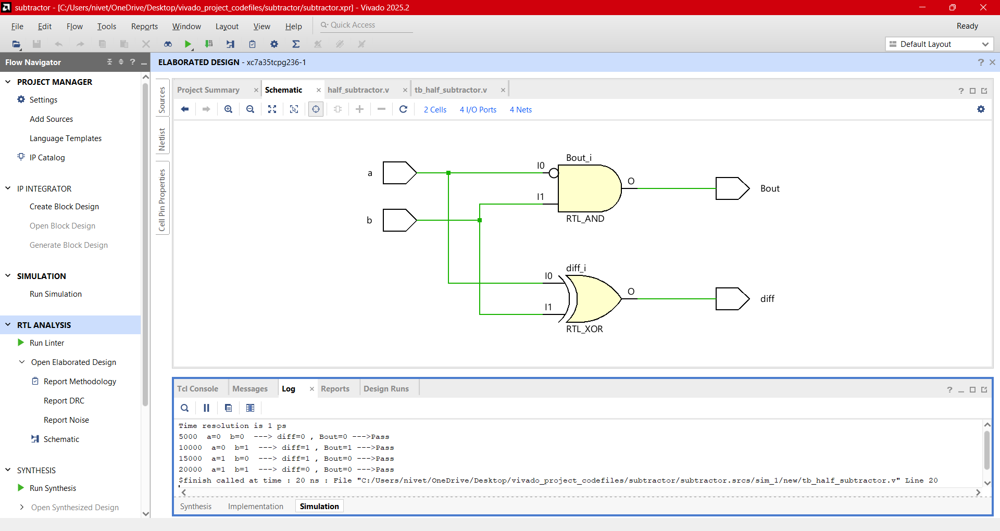

# Design:Half_Subtractor,Full_Subtractor
## Half_Subtractor:

<b>Touch here to see more</b>

   
  - Half Adder is a basic combinational design that can subtracts two single bits and results in a difference and borrow bit as an output.
  - The borrow obtained in one subtraction will not be forwarded in the next subtraction because of this it is known as half Subtractor whereas in Full Subtractor we can forward the borrow to other Subtractor.
    - **Inputs**: 1bit **A**,**B**.
    - **Outputs**: 1bit **Difference**,**Borrow**.
 ### Block Diagram
 

 
 ### Equation
   - **Difference** = A ^ B      ----> A exor B
   - **Borrow** = $\bar{A }$  & B   ----> ~A and B
### Half_subtractor(Verilog Codes)
-  Design module [half_subtractor.v](./src/half_subtractor.v) 
- Testbench [tb_half_subtractor.v](./tb/tb_half_subtractor.v) 
### Output Screenshots

---

## Full_subtractor using Half subtractor:

<b>Touch here to see more</b>

   
  - A combinational logic circuit that can add two binary digits (bits) and a borrow in bit, and produces a difference bit and a borrow out bit as output is known as a full-adder.
  - A full adder circuit adds three binary digits, where two are the inputs and one is the borrow forwarded from the previous subtraction.
    - **Inputs**: 1bit **A**,**B**,**Bin**.
    - **Outputs**: 1bit **Difference**,**Borrow**.
 ### Block Diagram
 

### Equation
   - **Diff** = A ^ B ^ Bin     ----> A exor B exor Bin
   - **Bout** = (A' & B)|(Bin &(A^B)') (or)   A'B+BBin+A'Bin
### Full_subtractor(Verilog Codes)
-  Design module [full_subtractor.v](./src/full_subtractor.v) 
- Testbench [tb_full_subtractor.v](./tb/tb_full_subtractor.v) 
### Output Screenshots

---
## Ripple_Carry_Adder or Parallel Adder:

<b>Touch here to see more</b>

   
  - Full adder can add single bit two inputs and extra carry bit generated from its previous stage. To add multiple 'n' bits binary sequence, multiples cascaded full adders can be used which can generate a carry bit and be applied to the next stage full adder as an input till the last stage of full adder. This appears as carry-bit ripples to the next stage, hence it is known as "Ripple carry adder".
    - **Inputs**: n-bit **A**,**B**,1-bit **Cin**.
    - **Outputs**: n-bit **Sum**,1-bit **Carry_out**.

### Ripple carry adder delay computation 
- Worst case delay = ((n-1) full adder * carry propagation delay of each adder)+ sum propagation delay of each full adder
 ### Block Diagram
 

### Ripple_Carry_Adder(Verilog Codes)
-  Design module [rca_adder.v](./src/rca.v) 
- Testbench [tb_rca_adder.v](./tb/tb_rca.v) 
### Output Screenshots

---
## Design Hierarchy
- Design Hierarchy is a "bottom-up" structure where simple modules (Half Adders) are nested inside larger modules (Full Adders) to build a complex system (Ripple Carry Adder).
  
## **Next Steps**

➡️ **[Navigate to Day 03](../day_04/)**

