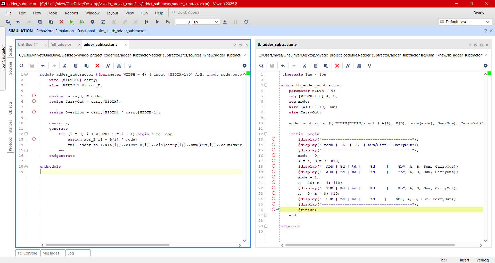
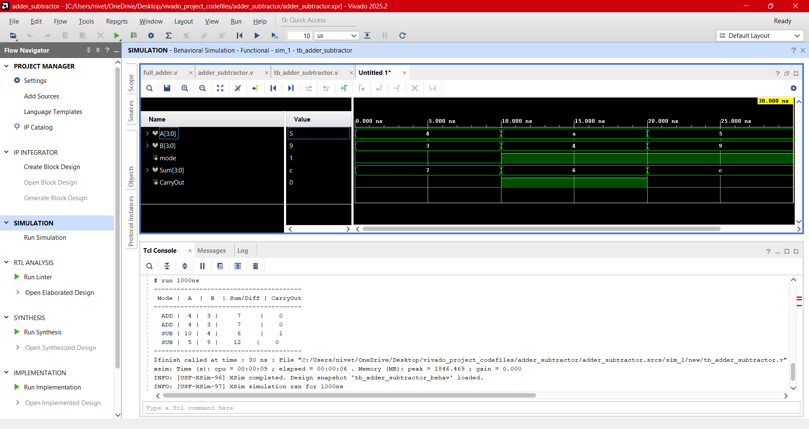
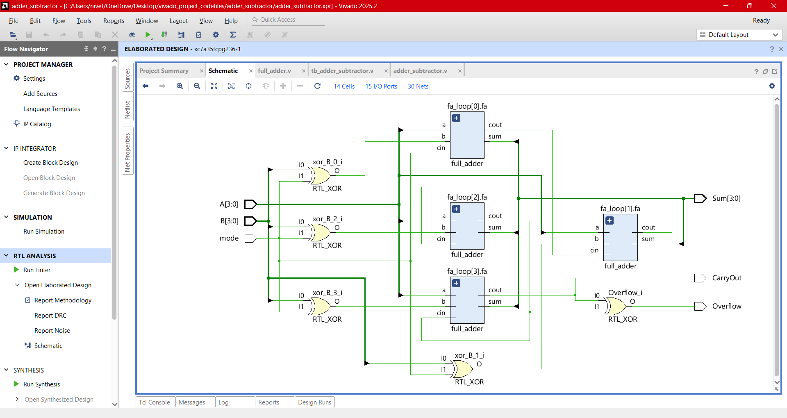

# Design:Binary Adder-Subtractor  

<b>Touch here to see more</b>

     
- Binary adder-subtractor consists of several full-adder circuits connected together. It also consists of a control circuit consisting of XOR gates and performs the mode selection function i.e., the control circuit is used to switch the circuit operation between addition and subtraction.
- In this circuit, the input M is called the mode input. It controls the operation of the circuit as 
     - When **M = 0**, the circuit operates as a binary adder. Under this mode, we get BX⊕0=BX.
     - Thus, each full adder receives the inputs Ax and Bx and performs their addition, i.e., Ax + Bx.
     - When M = 1, the circuit operates as a binary subtractor. In this case, we get BX⊕1=BX and the input carry Cin = 1. Under this mode, the full adders receive Bx inputs in their complemented form and a 1 is added through the input carry Cin. Hence, the final output of the circuit is Ax + 2s complement of Bx ---> Ax-Bx.
 ### Block Diagram

 ### Equation
 General operation A + (B⊕M) + M
   - if M=0,opertion => A + (B⊕0) + 0 ---> A + B
   - if M=1,operation => A + (1's of B) + M  ----> A + 2's of B ---> A-B
     
To Know more about **[Full_adder](../day_02/)** 
### Adder_subtractor(Verilog Codes)
-  Design module [adder_subtractor.v](./src/adder_subtractor.v) 
- Testbench [tb_adder_subtractor.v](./tb/tb_adder_subtractor.v) 
### Output Screenshots

 

  

  
---

## **Next Steps**

➡️ **[Navigate to Day 05](../day_05/)**

