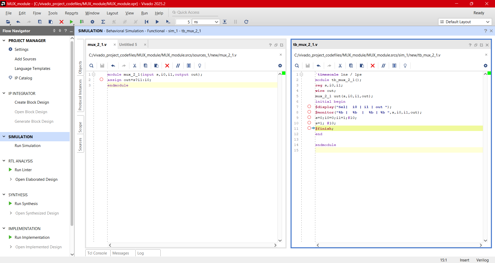
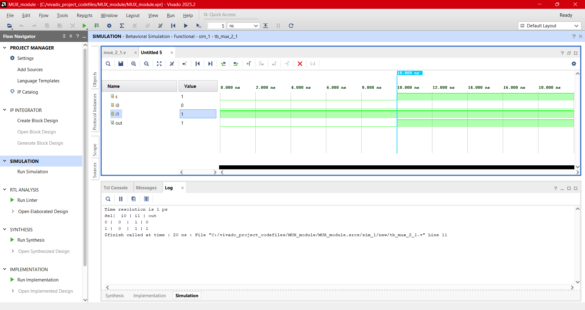
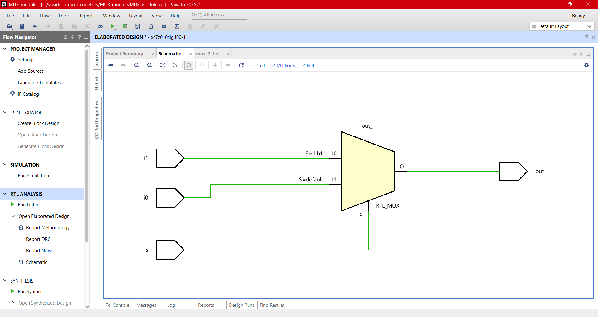
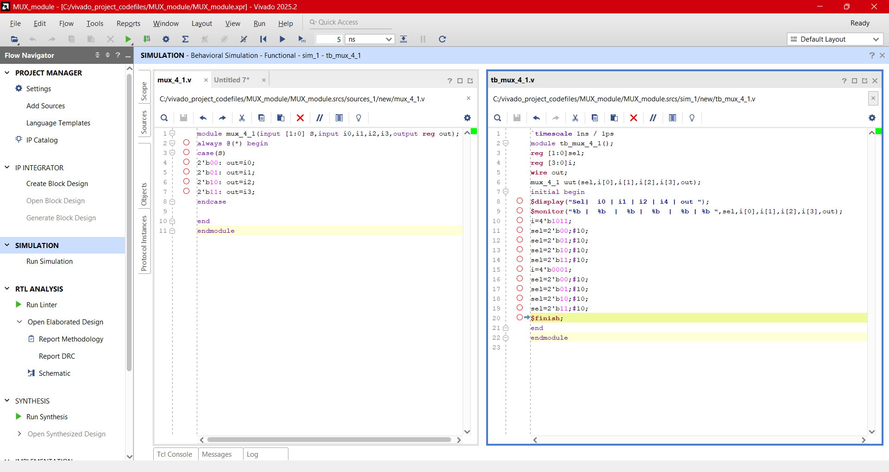
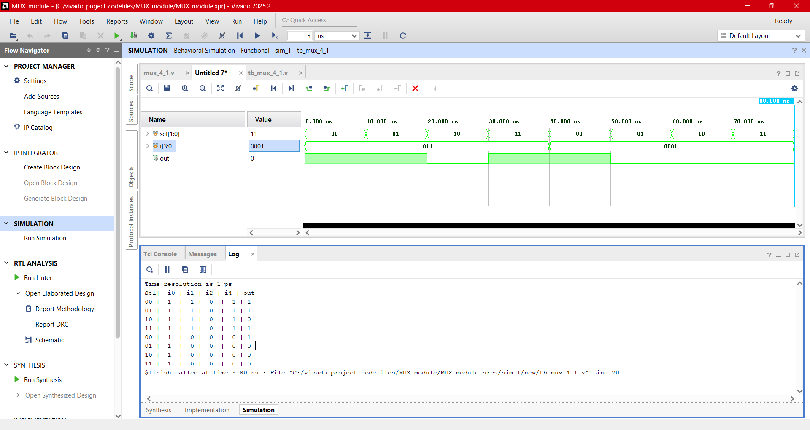
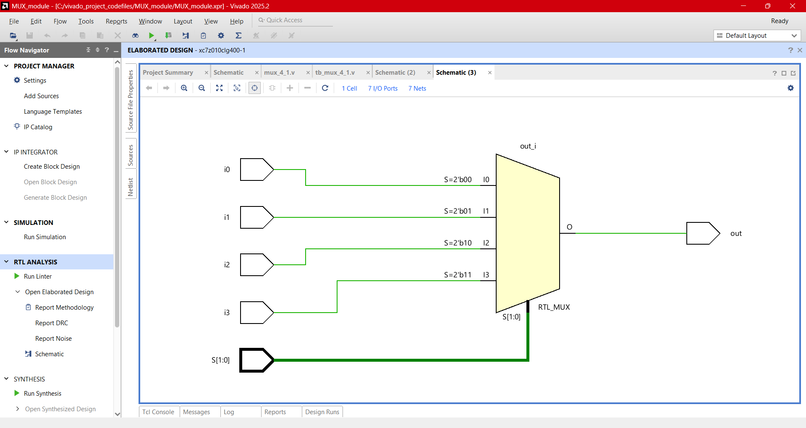
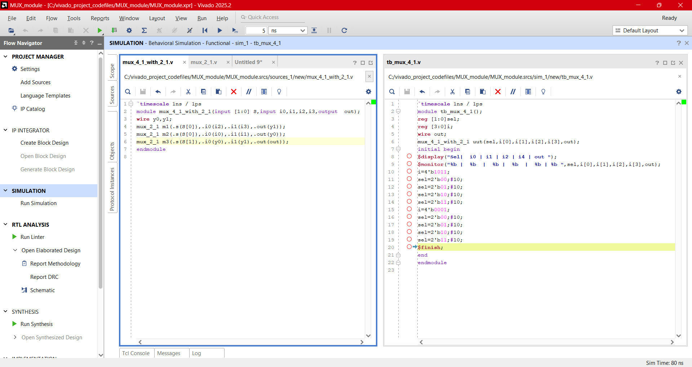
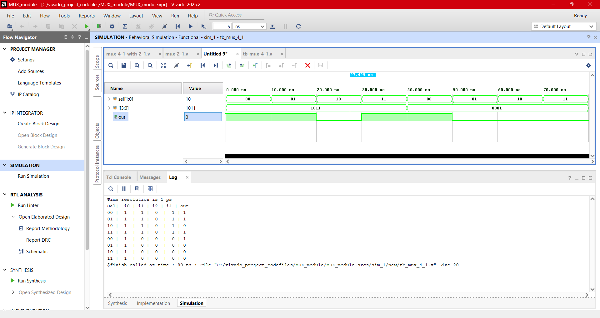
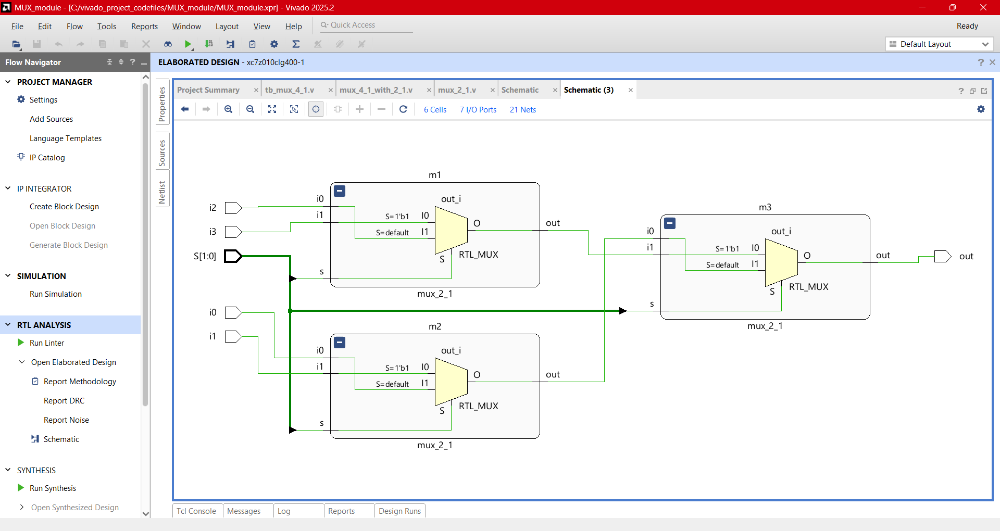

# Design:Multiplexer  
  - A Multiplexer(MUX) is a combinational circuit that connects any one line out of multiple N lines to the single output line based on its control input signal(selection lines).
  - For **n** selection lines, there are **N=2^n** input lines
  - **N:1** denotes N input lines and one output line.

## 2:1 MUX:

<b>Touch here to see more</b>

- Has 2 input lines and one select line.
  
  

  
| Select | Out |
|:---|:---|
|0	| i0|
|1	| i1|  

### Equation
   - **Out** = (~s&i0) | (s &i1)
### 2:1mux(Verilog Codes)
-  Design module [mux_2_1.v](./src/mux_2_1.v) 
- Testbench [tb_mux_2_1.v](./tb/tb_mux_2_1.v) 
### Output Screenshots

  
  
---  

## 4:1 MUX:

<b>Touch here to see more</b>

- Has 4 input lines and two select line.
  
  

  
| Sel[0]|Sel[1] | Out |
|:---|:---|:---|
|0	|0 | i0|
|0	|1 | i1|
|1 |0 |i2 |
|1  |1 |i3 |  

### 4:1mux(Verilog Codes)
-  Design module [mux_4_1.v](./src/mux_4_1.v) 
- Testbench [tb_mux_4_1.v](./tb/tb_mux_4_1.v) 
### Output Screenshots

  
  
---

## 4:1 MUX using 2:1 MUXes:

<b>Touch here to see more</b>

- Has 4 input lines and two select line.
  
  

  
| Sel[0]|Sel[1] | Out |
|:---|:---|:---|
|0	|0 | i0|
|0	|1 | i1|
|1 |0 |i2 |
|1  |1 |i3 |

### 4:1mux using 2:1 muxes (Verilog Codes)
-  Design module [mux_4_1_with_2_1.v](./src/mux_4_1_with_2_1.v) 
- Testbench [tb_mux_4_1_with_2:1.v](./tb/tb_mux_4_1_with_2_1.v)
  ### Output Screenshots

  
  
---

## **Next Steps**

➡️ **[Navigate to Day 07](../day_07/)**

