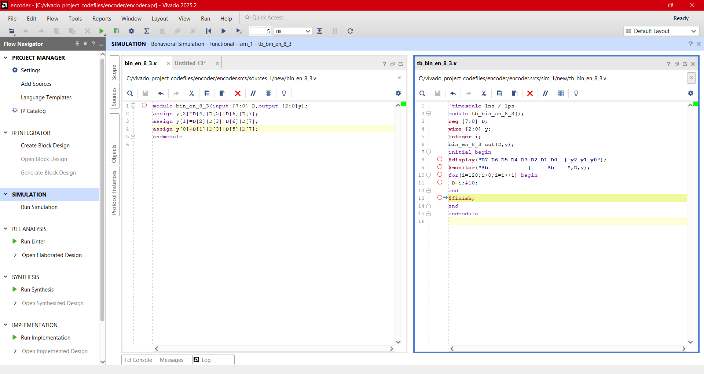
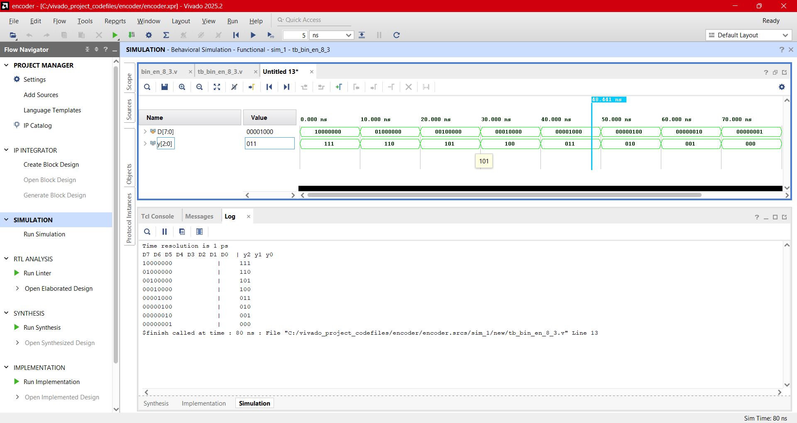
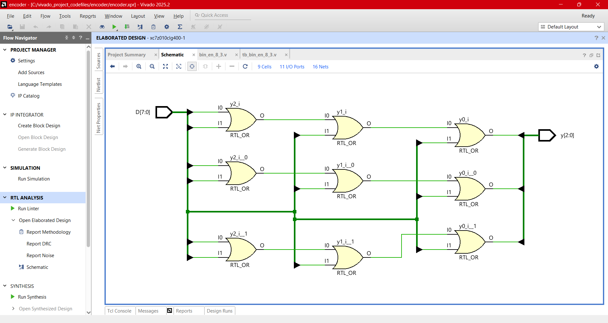
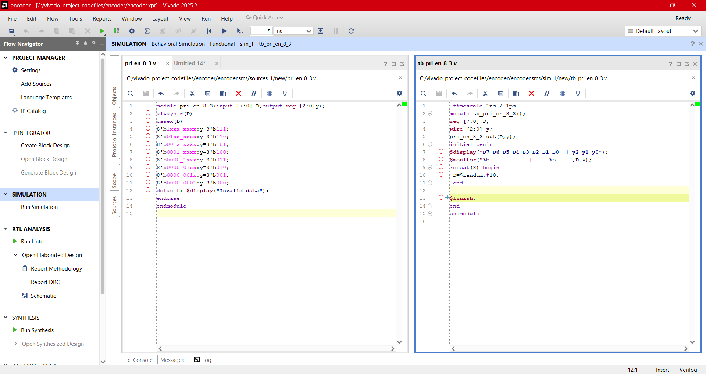
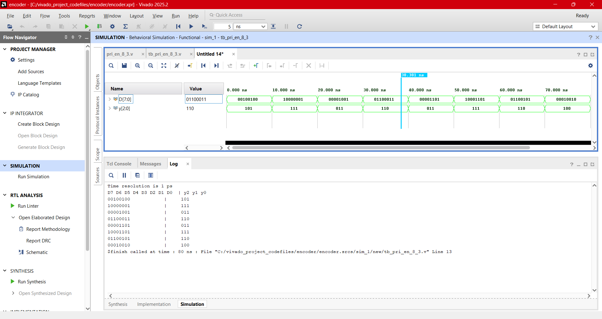
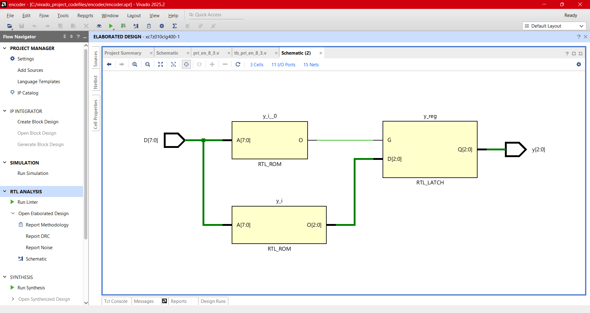

# Design:Encoder  
  - An encoder converts **M** input lines (decimal, hex, octal, etc.) into **N** coded output lines.
  - Various encoders can be designed such as decimal-to-binary encoders,octal-binary encoders,decimal-BCD encoders ,etc.
  - It "shrinks" receiving many input data lines into fewer output lines.This is helpful in reducing input data lines for further processing.
 

## Binary Encoder:

<b>Touch here to see more</b>

- A binary encoder converts **M (=2^n)** input lines to **N (=n)** coded binary code. It is also known as a digital encoder. A single input line must be high for valid coded output; otherwise, the output line will be invalid. To address this limitation, the priority encoder prioritizes each input line when multiple input lines are set to high.
- M:N encoder where M denotes input lines and N denotes coded output lines.

  ### 8:3 Binary Encoder:
  - 8:3 encoder where 8 denotes input lines and 3 denotes coded output lines.
    

 
  

### Equation
   - **y2=D4+D5+D6+D7**
   - **y1=D2+D3+D6+D7**
   - **y0=D1+D3+D5+D7**
### Verilog Codes
-  Design module [bin_en_8_3.v](./src/bin_en_8_3.v) 
- Testbench [tb_bin_en_8_3.v](./tb/tb_bin_en_8_3.v) 
### Output Screenshots

  
  
---  

## Priority Encoder:

<b>Touch here to see more</b>

- The priority encoder overcome the drawback of binary encoder that generates invalid output for more than one input line is set to high. The priority encoder prioritizes each input line and provides an encoder output corresponding to its highest input priority.
- The priority encoder is widely used in digital applications. One common example of a microprocessor detecting the highest priority interrupt. The priority encoders are also used in navigation systems, robotics for controlling arm positions, communication systems, etc.
  
  
 

### 8:3 Priority Encoder(Verilog Codes)
-  Design module [pri_en_8_3.v](./src/pri_en_8_3.v) 
- Testbench [tb_pri_en_8_3.v](./tb/tb_pri_en_8_3.v) 
### Output Screenshots

  
  
---

## **Next Steps**

➡️ **[Navigate to Day 09](../day_09/)**

