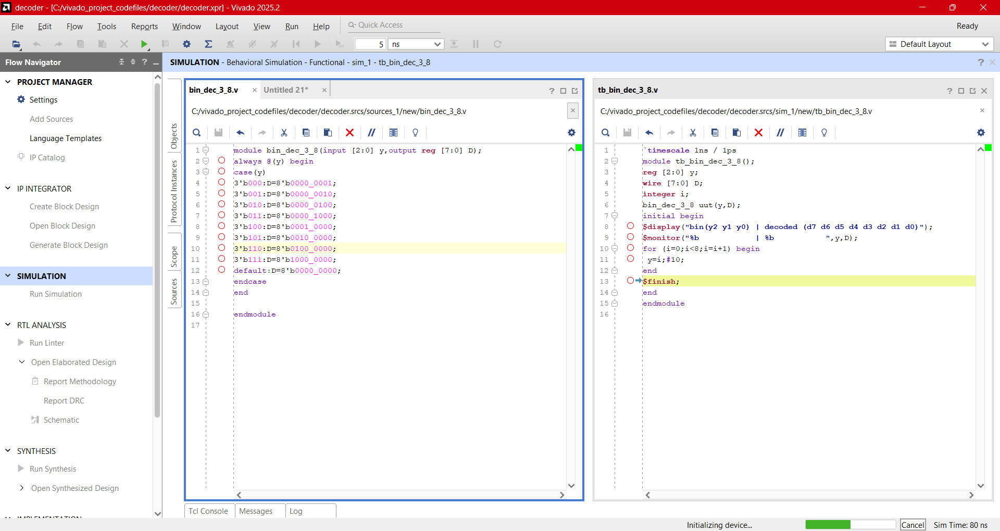
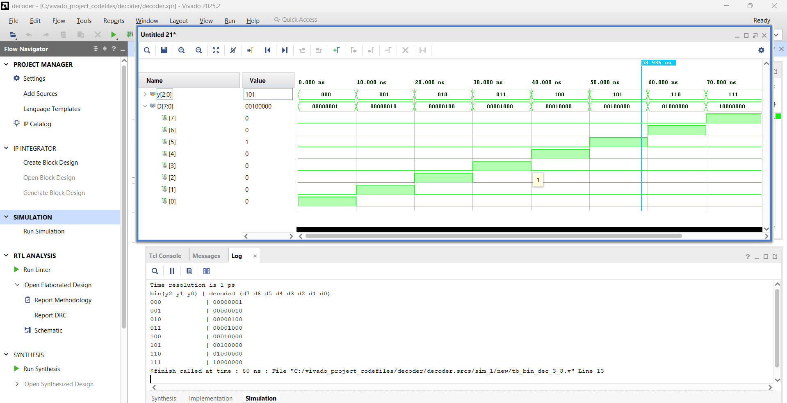

# Design:Decoder  
  - The decoder behaves exactly opposite of the encoder. They decode already coded input to its decoded form. The ‘N’(=n) input coded lines decode to ‘M’(=2^n) decoded output lines. The decoder sets exactly one line high at the output for a given encoded input line.
  - **N: M** decoder where N denotes coded input lines and M denotes decoded output lines.

## 3:8 Decoder:

<b>Touch here to see more</b>
  

  
  -The 3 input lines denote 3-bit binary code and 8 output line represents its decoded decimal form.
    

 
  

### Verilog Codes
-  Design module [bin_dec_3_8.v](./src/bin_dec_3_8.v) 
- Testbench [tb_bin_dec_3_8.v](./tb/tb_bin_dec_3_8.v) 
### Output Screenshots

  
  
---  

## Priority Encoder:

<b>Touch here to see more</b>

- The priority encoder overcome the drawback of binary encoder that generates invalid output for more than one input line is set to high. The priority encoder prioritizes each input line and provides an encoder output corresponding to its highest input priority.
- The priority encoder is widely used in digital applications. One common example of a microprocessor detecting the highest priority interrupt. The priority encoders are also used in navigation systems, robotics for controlling arm positions, communication systems, etc.
  
  
 

### 8:3 Priority Encoder(Verilog Codes)
-  Design module [pri_en_8_3.v](./src/pri_en_8_3.v) 
- Testbench [tb_pri_en_8_3.v](./tb/tb_pri_en_8_3.v) 
### Output Screenshots

  
  
---

## **Next Steps**

➡️ **[Navigate to Day 09](../day_09/)**

