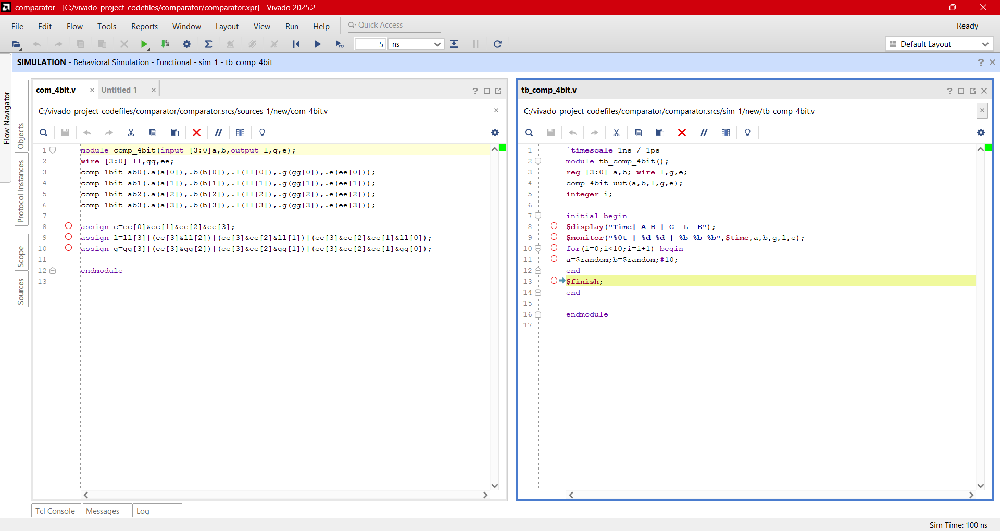
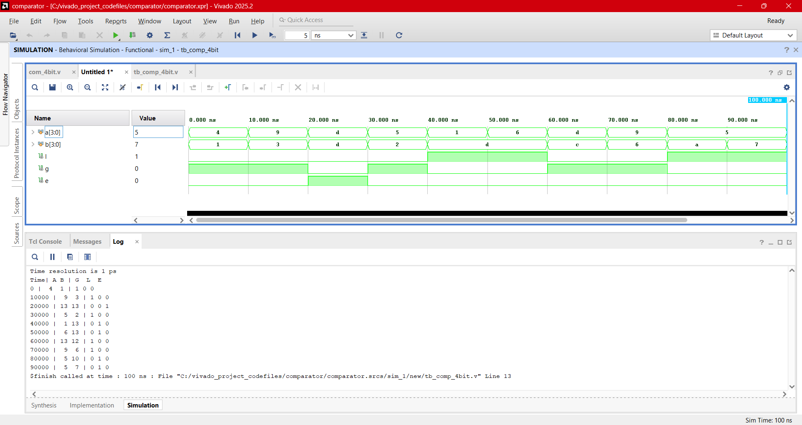
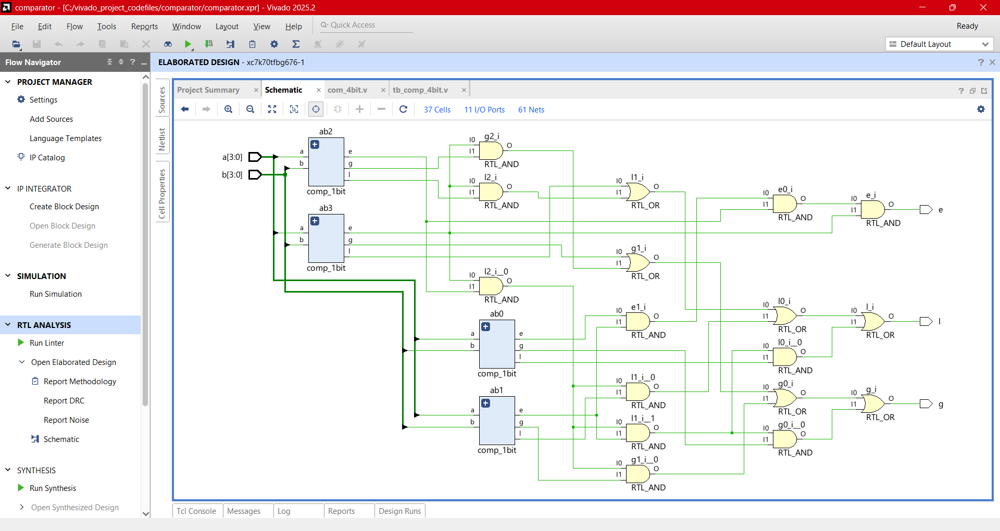
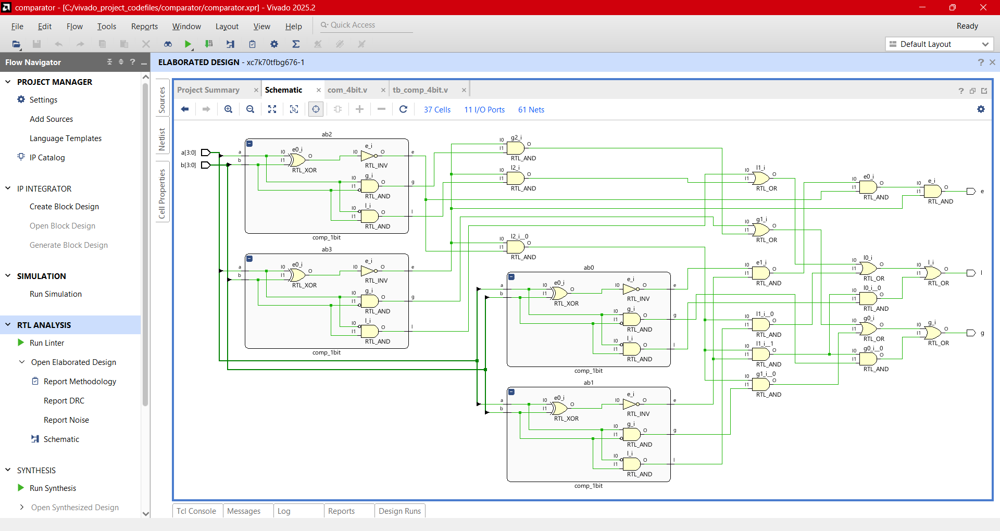

# Design:Comparator
  - A digital combinational circuit used to compare the magnitude of two binary numbers to determine the equality or non-equality is called a comparator.
  - Therefore, the main function of a comparator is to compare the values of input numbers and produce an output indicating whether the numbers are equal or first numbers is greater or lesser.

## 1-bit Comparator:

<b>Touch here to see more</b>
  

  
  - A 1-bit magnitude comparator is a logic circuit which can compare two binary numbers of one bit each.
  - In other words, a 1-bit magnitude comparator is one that compares two 1-bit binary numbers and generates an output showing whether one number is equal to or greater than or less than the other.
    
  

### **1-Bit Magnitude Comparator Truth Table**

| A | B | A < B | A = B | A > B |
| --- | --- | --- | --- | --- |
| 0 | 0 | 0 | 1 | 0 |
| 0 | 1 | 1 | 0 | 0 |
| 1 | 0 | 0 | 0 | 1 |
| 1 | 1 | 0 | 1 | 0 |

### **Logical Expressions**

* **Greater Than ($A > B$):** This output is high only when $A=1$ and $B=0$.

$$A > B = A\bar{B}$$

* **Equal To ($A = B$):** This output is high when both inputs are the same ($0,0$ or $1,1$). This corresponds to the **XNOR** operation.

$$A = B = \bar{A}\bar{B} + AB = \overline{A \oplus B}$$

* **Less Than ($A < B$):** This output is high only when $A=0$ and $B=1$.

$$A < B = \bar{A}B$$

 
  
### Verilog Codes
-  Design module [comp_1bit.v](./src/comp_1bit.v) 
- Testbench [tb_comp_1bit.v](./tb/tb_comp_1bit.v) 
### Output Screenshots

  
  
---  

## 4-bit Comparator:

<b>Touch here to see more</b>
  

  
  -It is a type of comparator that can compare the values or magnitudes of two 4-bit binary numbers and produce an output indicating whether one number is equal to or less than or greater than the other.
    

 

### Comparison Logic Flow
- Step 1:Compare $A_3$ and $B_3$. If $A_3 \neq B_3$, the result ($A>B$ or $A<B$) is immediately determined.
- Step 2: If $A_3 = B_3$, the circuit checks the next significant bits ($A_2$ and $B_2$).
- Step 3: This cascading logic continues down to $A_0$ and $B_0$.
- Step 4: If all bit pairs are equal, the $A=B$ output becomes high.

 
  
### Verilog Codes
-  Design module [comp_4bit.v](./src/comp_4bit.v) 
- Testbench [tb_comp_4bit.v](./tb/tb_comp_4bit.v) 
### Output Screenshots

  
  
---  

## **Next Steps**

➡️ **[Navigate to Day 11](../day_11/)**

